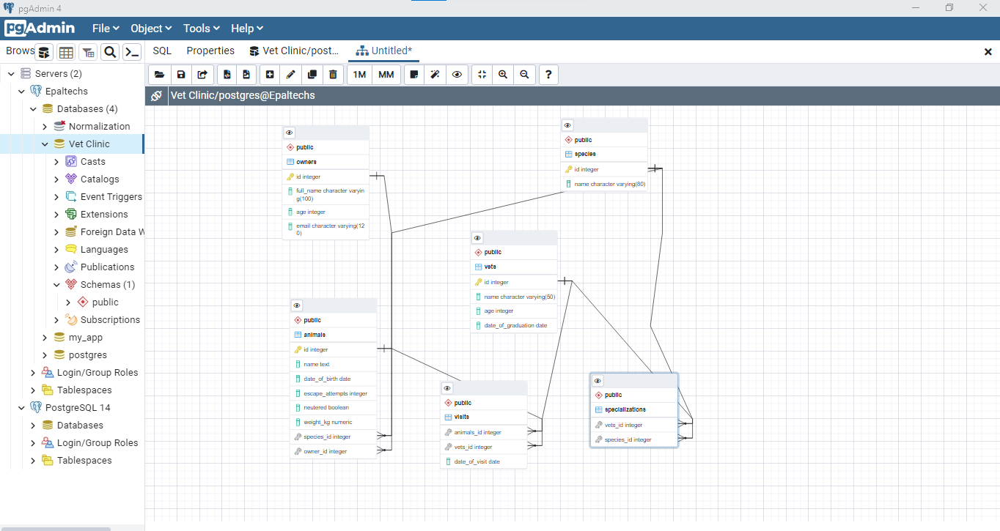

# Vet-Clinic Database

> This is an SQL database that records data of dogs in a vet clinic, stores the data in a table and makes it possible to query the data input.

## Getting Started

This repository includes files with plain SQL that can be used to recreate a database:

- Use [schema.sql](./schema.sql) to create all tables.
- Use [data.sql](./data.sql) to populate tables with sample data.
- Check [queries.sql](./queries.sql) for examples of queries that can be run on a newly created database. **Important note: this file might include queries that make changes in the database (e.g., remove records). Use them responsibly!**

## Author
## 👤 **Emmanuel Paul**

- GitHub: [Emmanuel Paul](https://github.com/Epaltechs/Vet-clinic)
- Twitter: [Emmanuel Paul](http://twitter.com/@emmapaul247)
- LinkedIn: [Emmanuel Paul](https://www.linkedin.com/in/emmanuel-s-paul/)

## :handshake: Contributing
Contributions, issues, and feature requests are welcome!
Feel free to check the [issues page](https://github.com/Epaltechs/Vet-clinic/issues).

## Show your support
Give a :star:️ if you like this project!

## Acknowledgments
-🎩Hat tip to anyone whose code was used
- I hail all those who gave me inspiration and who in one way or the other have contributed to this project.

## :memo: License
This project is [MIT](./MIT.md) licensed.
